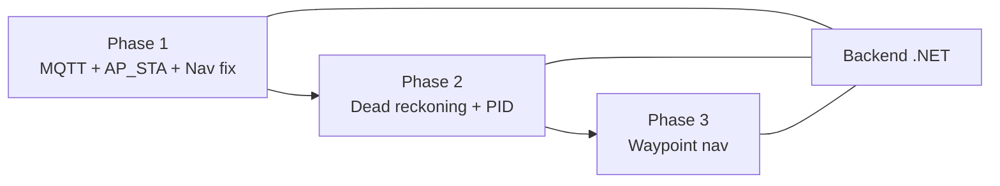

# SmartMarketBot — Roadmap 3 Phase (BE + IoT)

> **Role:** Backend + IoT only.  
> **Firmware:** `ESP32-S3/SuperMarketBot-IOT/`  
> **Backend:** `SuperMarketBot-BE/src/`

## Phụ thuộc

| Phase | Thời gian ước tính | IoT | BE |
|-------|-------------------|-----|-----|
| **1** | 1–2 ngày | `MqttClient.h`, AP+STA, nav quick fix | Telemetry MQTT, `navigate-robot` |
| **2** | 3–5 ngày | `Localization.h`, `PidController.h` | `Heading`, `/pose` |
| **3** | 5–7 ngày | `WaypointNav.h`, MODE_WAYPOINT | `NavigationCommandService`, reroute |

## Trạng thái hiện tại (cập nhật khi làm xong)

- [ ] Phase 1
- [ ] Phase 2
- [ ] Phase 3

## MQTT contract (đồng bộ BE ↔ ESP32)

| Hướng | Topic |
|-------|--------|
| Telemetry | `smartmarketbot/robot/{robotCode}/telemetry` |
| Status | `smartmarketbot/robot/{robotCode}/status` |
| Command | `smartmarketbot/robot/{robotCode}/command` |

**robotCode** mặc định firmware: `ROBOT-01` (`MQTT_CLIENT_ID` trong `Config.h`).

**Broker:** Mosquitto `192.168.x.x:1883` (máy chạy `docker compose` BE).

## WiFi sau Phase 1

- **AP** (giữ): `SmartMarketBot` / `12345678` — tablet HMI `http://192.168.4.1`
- **STA** (mới): router nhà/lab — MQTT tới backend
- STA fail → robot vẫn chạy AP-only, MQTT tắt

## File chi tiết + prompt Cursor

| Phase | File |
|-------|------|
| 1 | [phase-1-mqtt-apsta-nav.md](./phase-1-mqtt-apsta-nav.md) |
| 2 | [phase-2-deadreckoning-pid.md](./phase-2-deadreckoning-pid.md) |
| 3 | [phase-3-waypoint-nav.md](./phase-3-waypoint-nav.md) |

## Cách dùng với Cursor

1. Mở đúng repo (`SuperMarketBot-IOT` hoặc `SuperMarketBot-BE`).
2. Copy **một prompt** từ file phase tương ứng → Composer (Ctrl+I).
3. Làm xong → tick checklist trong file phase + `00-OVERVIEW.md`.
4. **Không nhảy phase** nếu checklist phase trước chưa xong.

## Nguyên tắc cố định (mọi phase)

- PubSubClient / MQTT: **chỉ gọi từ taskWebIO (Core 0)** — dùng `volatile` flag từ Core 1.
- **Không** sửa motor/LiDAR FSM trừ khi prompt phase cho phép.
- Giữ tương thích bảng `Members`, `Robot_Logs`, views n8n trên BE.
